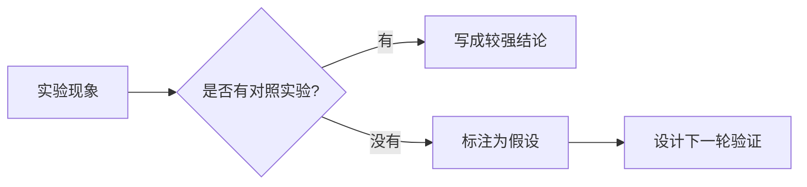

很多实验失败不是因为没有价值，而是因为没有被记录成可以再次理解的形式。下面这个模板适合写仿真、实验、模型训练、参数对比或论文复现。

## 1. 研究问题

先用一句话写清楚这次实验到底想验证什么：

> 在当前约束下，某个策略是否比基线方法更稳定、更省能或更容易解释？

如果一句话写不出来，说明实验目标还需要继续收敛。

## 2. 实验设置

记录最容易被遗忘、但复现时最关键的信息：

- 数据来源或工况来源
- 基线方法和对比方法
- 主要参数
- 评价指标
- 运行环境和代码版本

```yaml
experiment:
  baseline: ECMS
  method: MPC + SAC weight fusion
  metrics:
    - fuel_consumption
    - soc_error
    - torque_smoothness
  note: 记录真实参数，不要只写“默认设置”
```

## 3. 结果观察

结果不要只贴图，至少写三类观察：

1. 与预期一致的现象。
2. 与预期不一致的现象。
3. 目前无法解释、需要追加实验的现象。

## 4. 初步解释

解释要区分“数据支持”和“个人猜测”。



## 5. 下一步行动

每篇实验记录最后都要留下可执行事项：

- 补充一个更简单的 sanity check。
- 固定随机种子并重复运行。
- 输出统一格式的结果表。
- 把关键图整理成论文级别版本。

这样的记录不一定漂亮，但它能减少重复劳动，也能让未来写论文时少翻很多旧文件。

